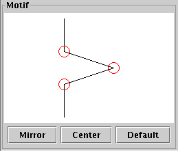

# Line Fractal Application

For more information on fractals, please see
[Wikipedia](http://en.wikipedia.org/wiki/Fractal) or
[Mathworld](http://mathworld.wolfram.com/Fractal.html). Mathworld's
entry on [Lindenmayer
Systems](http://mathworld.wolfram.com/LindenmayerSystem.html) has some
nice links to some of the fractals this application can generate.

## Installation

Requires Java SE 11.

```
cd src
javac *.java
java FractalApplication
```

Or with make:

```
cd src
make
make run
```

## History

This code was written around the year 2000. I've made no changes apart from porting it to Java 11, fixing linter warnings, and converting the html documentation to markdown. Please consider that this is >20-year old code (forEach, Eclipse, git, etc. did not exist back then), and I am aware that things would be done differently today.

## Manual

Base-motif fractals are formed by repeatedly substituting line segments
with a figure called the motif. The initial set of line segments is
called the base curve. The application consists of three subpanels which
display the base curve, the motif, and the fractal generated from them.

### Well Known Fractals Panel

This list allows you to display some well-known fractals. It
automatically sets the base curve and motif in the panels below.

### Base Curve Panel

The base curve panel allows you to choose the initial set of lines from
which the fractal is generated. It can be a line, a triangle or a
square. When the bidirectional option is chosen, the motif will be
applied to both sides of each line.

### Motif Panel

The motif panel allows you to draw a motif that will be applied
recursively to each line of the base curve. You can move a point by
clicking in the red circle, and dragging it somewhere else. Also, you
can add a point by clicking near a line (but not in the red circle). The
fractal is automatically updated once te mouse is released.

The buttons below the motif allow you to mirror it along the vertical
axis, center it on the canvas, and reset the motif to the default.



### Fractal Panel

This panel shows the fractal that is generated from the base curve and
the motif. The +++ button applies the motif to all lines in the fractal,
and the --- goes one step back. The number of lines in the fractal is
also displayed. It is limited to 200000 lines to avoid memory overloads.

Sometimes, the fractal grows out of its frame. The "Center" button
centers the fractal on the frame. The "Auto Center" option
continuously centers the fractal.
